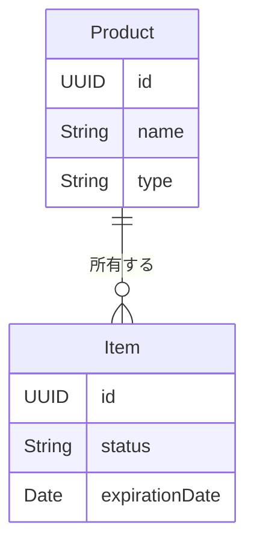

# データモデル仕様（Core Data の論理モデル）

> [概要](./index.md) / [同期・移行](./sync-migration-spec.md)

## モデルの境界

実装時の Core Data エンティティ名は設計段階で確定する。ここでは商品と個体を分けた論理モデル、必須項目、関係と不変条件を定める。サーバーの SQL テーブルは設けない。

## Product（商品）

| 属性 | 型 | 必須 | 意味 |
|:--|:--|:--|:--|
| id | UUID | はい | 同期端末間で同じ商品を識別する不変の ID |
| name | String | はい | 空白のみ不可 |
| type | String | はい | 空白のみ不可 |
| image | Binary / 画像参照 | いいえ | 商品画像。同期対象 |
| priceYen | Int64 | いいえ | 0以上の円。未設定と0を区別 |
| nutrients | 数値群 | いいえ | カロリー、タンパク質、脂質、糖質、炭水化物。各項目の未設定と0を区別 |
| updatedAt | Date | はい | 同期競合判定用の更新日時 |

栄養素の単位・基準量・小数精度は[レビュー事項](./index.md#レビューで決める事項)。その決定前に既存の整数値を別の単位へ換算しない。

## Item（個体）

| 属性 | 型 | 必須 | 意味 |
|:--|:--|:--|:--|
| id | UUID | はい | 1本ごとの不変の ID |
| product | Product への参照 | はい | 所属する商品 |
| expirationDate | Date（日付として扱う） | いいえ | 賞味期限 |
| status | unopened / inUse / consumed | はい | 未開封 / 使用中 / 使い切り |
| openingDate | Date（日付） | 使用中・使い切りでははい | 開封日 |
| consumedDate | Date（日付） | 使い切りでははい | 使い切り日 |
| updatedAt | Date | はい | 同期競合判定用の更新日時 |

履歴は別のコピーを作らず、`consumed` の個体を照会して表示する。個体を削除した場合はその ID の削除を同期に反映する。

## 関係と整合性

| ルール | 要件 |
|:--|:--|
| 個体の所属 | 存在する商品を必ず1件参照する。商品を削除しても孤児の個体を作らない。 |
| 商品削除 | `unopened`・`inUse`・`consumed` の個体が1件でもあれば拒否する。 |
| 状態 | 未開封には開封日・使い切り日を持たせない。使用中には開封日があり使い切り日はない。使い切りには両方の日付がある。 |
| 日付 | 開封日は未来不可。使い切り日は開封日より前にできない。賞味期限は任意で、過去の日付も登録可能。 |
| 数値 | 価格と栄養素は未設定または0以上。入力不能な値を0へ自動変換しない。 |

保存時に関係と状態の整合性を検証し、違反する変更は一部だけ保存しない。商品名・種類の重複に一意制約は設けず、自動統合もしない。

## 現行・旧モデルとの対応

| ソース | 役割 | 備考 |
|:--|:--|:--|
| 現行 `Seasoning` | 商品と個体の情報が混在 | `name`, `type`, `image`, `expirationDate`, `openingDate`, `identifier`。状態はない。 |
| 旧 `SeasoningData` | 商品の原型 | 名前・種類・画像・価格・栄養素への参照。`src/old` の参考コード。 |
| 旧 `Seasoning` | 個体の原型 | 賞味期限・開封日・`inUse` と商品への参照。使い切り日はない。 |
| 旧 `SeasoningNutrients` | 栄養素の原型 | 5項目を整数で保持。単位の定義はない。 |

現行保存領域からの変換規則は[同期・移行仕様](./sync-migration-spec.md)に定める。旧アプリの別保存領域からの自動取り込みを保証するものではない。
