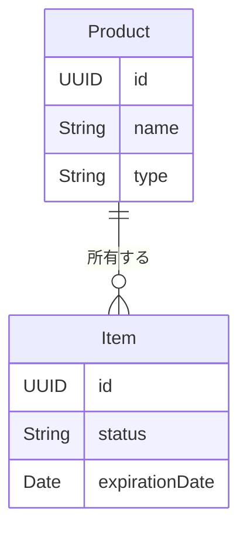

# データモデル仕様（SwiftData の論理モデル）

> [概要](./index.md) / [同期・移行](./sync-migration-spec.md)

## モデルの境界

現行の `Item(timestamp)` はXcodeのひな形であり、以下の調味料の「個体」とは別物。実装時に置き換える。ここでは SwiftData の永続化モデルとして商品と個体を分け、利用者に対する必須項目、関係と不変条件を定める。サーバーの SQL テーブルは設けない。

表の「必須」は**アプリで保存・表示するときの業務上の要件**を示す。CloudKit と同期する SwiftData スキーマではリレーションを省略可能にする必要があり、表の要件をそのまま非Optionalな永続化プロパティで表すとは限らない。同期途中の一時的な欠落はアプリ層で扱う。

## Product（商品）

| 属性 | 型 | 必須 | 意味 |
|:--|:--|:--|:--|
| id | UUID | はい | 同期端末間で同じ商品を識別する不変の ID。CloudKit非対応の一意制約には頼らない |
| name | String | はい | 空白のみ不可 |
| type | String | はい | 自由入力。前後の空白・改行を除き、空文字不可。内部表記は自動統合しない |
| image | Binary / 画像参照 | いいえ | 商品画像。同期対象 |
| priceYen | Int64 | いいえ | 0以上の円。未設定と0を区別 |
| nutrients | 各項目が Int64? の数値群 | いいえ | カロリー（kcal）・タンパク質・脂質・糖質・炭水化物（g）を100倍した整数。各項目の `nil` と0を区別 |
| nutrientBasisAmount | Int64? | 条件付き | 基準量を100倍した整数。栄養素があれば正数を必須とする |
| nutrientBasisUnit | String? | 条件付き | 基準単位の自由入力文字列。栄養素があれば周辺空白除去後の非空文字列を必須とする |
| updatedAt | Date | はい | 同期競合判定用の更新日時 |

栄養素は独立した5つのOptional値として扱う。新規商品の栄養素5項目・基準量・基準単位の初期値は全て `nil` とし、保存前に下記の共通ルールを検証する。これは論理表現であり、具体的なSwiftDataの属性配置とCloudKit互換性は後続の検証で確定する。

## 種類・栄養素の共通入力規則（#14）

Issue #14で種類の入力方式と栄養素の単位・基準量・精度を以下のとおり具体化する。概要の旧レビュー一覧に残る未決定記述より、この規則を優先する。種類の表示順・検索は今回の決定対象に含めない。

### 種類と空白

- 種類は必須の自由入力とする。前後の空白・改行を除き、空文字を拒否する。内部の表記は変更せず、表記ゆれや同名・同種類の商品を自動統合しない。
- この節の周辺空白除去には半角・全角スペース、タブ、改行、Unicodeの空白文字を含める。種類・基準単位の内部空白は保持し、数値内の空白は不正な書式として拒否する。

### 栄養素と基準

| 入力項目 | 単位 | 入力範囲・精度 |
|:--|:--|:--|
| カロリー | kcal | 0以上、小数点以下2桁まで。任意 |
| タンパク質・脂質・糖質・炭水化物 | g | 各項目とも0以上、小数点以下2桁まで。各任意 |
| 基準量 | 基準単位と組み合わせる | 0より大きい値、小数点以下2桁まで。栄養素があれば必須 |
| 基準単位 | 自由入力（例: `g`、`mL`、`食`、`個`、`杯（大さじ）`） | 前後の空白・改行を除いた非空文字列。栄養素があれば必須 |

- 5つの栄養素はそれぞれ独立した任意入力とする。空欄は未設定（`nil`）、明示した `0` は数値の0として保存する。編集で値を消した場合も `nil` に戻す。糖質と炭水化物など、他の項目から計算・補完しない。
- 周辺空白を除いた栄養素の入力文字列が1項目でも非空なら、全栄養素に共通の基準量・基準単位を必須にする。`0` も入力済みに含める。入力済みかどうかを数値変換の成否で判定せず、`abc` や `NaN` は検証エラーとし、未設定へ置き換えない。
- 栄養素が全て空欄なら、5項目・基準量・基準単位を全て `nil` にする。基準だけ入力していても保存されないことをフォームに示す。最後の栄養素を消した場合も同じ扱いとする。新規フォームは全て空欄で開始し、100gを暗黙に設定しない。
- パッケージの基準をそのまま入力する。例: `100`＋`g`、`15`＋`mL`、`1`＋`食`、`1`＋`個`、`1`＋`杯（大さじ）`。1食分の重量や大さじの容量を推測せず、100gへの換算やgとmLの変換を行わない。基準を確認できない場合は栄養素を未設定にして商品を保存できる。
- 入力欄には栄養素の単位を常時表示し、詳細には基準量・基準単位と「あたり」を併記する。未設定は「未設定」、0は単位付きの `0` と表示する。再編集時の未設定欄は空欄とし、5項目をそれぞれ対応する欄へ復元する。
- 基準量・基準単位を編集しても、既存の栄養値を自動換算しない。全栄養素の基準が変わることをフォームに示し、全入力値を保存前に見直せるようにする。

### 数値書式と論理保存値

- 周辺空白を除去した数値は、半角数字の整数部と、任意の小数点 `.` ＋1〜2桁で入力する。符号・指数表記・桁区切り・単位混在・数値でない文字列・小数点のみ・末尾小数点・小数点以下3桁以上は拒否する。丸め・切り捨て・不正値の0への置換は行わない。
- 栄養素・基準量は正確な十進数として検証し、100倍した整数を各 `Int64?` の論理保存値とする（`0.01` → `1`、`12.34` → `1234`、`0` → `0`、空欄 → `nil`）。浮動小数点の近似値から丸めて保存しない。表示・再編集時は100分の1の値に戻し、不要な末尾の0は省略できる。
- 保存可能な栄養値は `0`〜`92233720368547758.07`、基準量は `0.01`〜`92233720368547758.07` とする。100倍した整数が `Int64` の範囲を超える値は拒否する。この上限は保存形式上の制限であり、栄養学上の妥当性を保証するものではない。
- 画面と保存直前で同じ検証を行う。不正入力時は該当欄に理由を示し、入力を保持して商品全体を保存しない。一部だけ保存しないという業務要件であり、具体的なトランザクション方式は指定しない。
- 価格にはこの小数規則を適用せず、従来どおり任意の0以上の整数の円とし、未設定と0を区別する。業務上の必須とSwiftData / CloudKitの永続化Optionalを混同せず、具体的な栄養値の配置と同期互換性は後続の検証で決める。
- 単位・基準が不明な旧 `SeasoningNutrients` の整数を、新しい100倍整数として転用・換算しない。旧 `Seasoning` にない栄養素・基準量・基準単位は `nil` とする。

画面・保存・再編集の確認条件は[商品カタログの入力仕様の確認例](./catalog-spec.md#入力仕様の確認例)を共通で使用する。

## Item（個体）

| 属性 | 型 | 必須 | 意味 |
|:--|:--|:--|:--|
| id | UUID | はい | 1本ごとの不変の ID |
| product | Product への参照 | はい（業務上） | 所属する商品。同期用の永続化リレーションはOptionalとし、参照切れを画面へ出さない |
| expirationDate | Date（日付として扱う） | いいえ | 賞味期限 |
| status | unopened / inUse / consumed | はい | 未開封 / 使用中 / 使い切り |
| openingDate | Date（日付） | 使用中・使い切りでははい | 開封日 |
| consumedDate | Date（日付） | 使い切りでははい | 使い切り日 |
| updatedAt | Date | はい | 同期競合判定用の更新日時 |

履歴は別のコピーを作らず、`consumed` の個体を照会して表示する。個体を削除した場合はその ID の削除を同期に反映する。

## 関係と整合性

| ルール | 要件 |
|:--|:--|
| 個体の所属 | 存在する商品を必ず1件参照する。商品を削除しても孤児の個体を作らない。 |
| 商品削除 | `unopened`・`inUse`・`consumed` の個体が1件でもあれば拒否する。 |
| 状態 | 未開封には開封日・使い切り日を持たせない。使用中には開封日があり使い切り日はない。使い切りには両方の日付がある。 |
| 日付 | 開封日は未来不可。使い切り日は開封日より前にできない。賞味期限は任意で、過去の日付も登録可能。 |
| 数値 | 価格は未設定または0以上の整数の円。栄養素・基準量・基準単位は上記の共通入力規則に従う。未設定・不正値を0へ自動変換しない。 |

保存時に関係と状態の整合性を検証し、違反する変更は一部だけ保存しない。商品名・種類の重複に一意制約は設けず、自動統合もしない。商品削除の禁止と ID の重複防止は CloudKit の一意制約やリレーションの `.deny` 削除規則には頼らず、アプリ層と同期後の整合性検査で満たす。複数端末間で同時に更新した場合の実現方式は[同期・移行仕様](./sync-migration-spec.md)で検証する。

## 現行・旧モデルとの対応

| ソース | 役割 | 備考 |
|:--|:--|:--|
| 新 `Item(timestamp)` | Xcodeひな形のデータ | 調味料の個体データではない。置き換える。 |
| 旧 `Seasoning` | 商品と個体の情報が混在 | `old/src/SeasoningManager` の Core Data モデル。`name`, `type`, `image`, `expirationDate`, `openingDate`, `identifier`。状態はない。 |
| 旧 `SeasoningData` | 商品の原型 | 名前・種類・画像・価格・栄養素への参照。`old/src/old` の参考コード。 |
| 試作版の `Seasoning` | 個体の原型 | 賞味期限・開封日・`inUse` と商品への参照。使い切り日はない。 |
| 旧 `SeasoningNutrients` | 栄養素の原型 | 5項目を整数で保持。単位の定義はない。 |

旧 Core Data 保存領域から SwiftData への変換規則は[同期・移行仕様](./sync-migration-spec.md)に定める。別の試作アプリの保存領域からの自動取り込みを保証するものではない。
