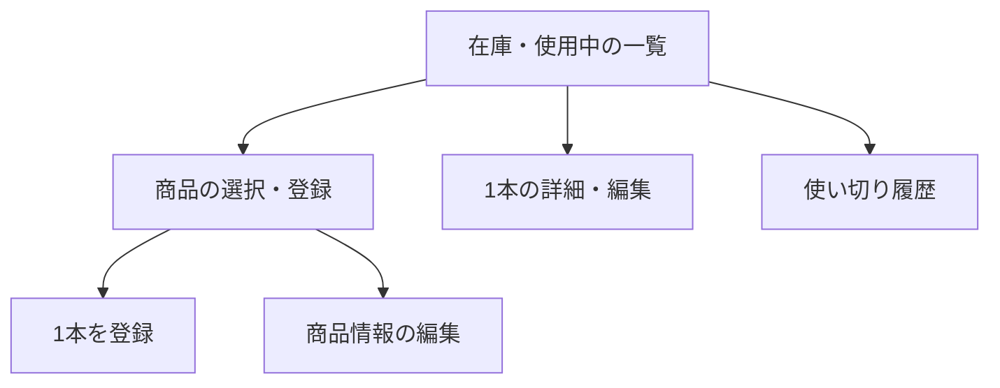

# 調味料管理アプリ 機能仕様（草案）

> 作成日: 2026-09-28 / 対象: `seasoning-management-iOS` のアプリ全体

## 目的と対象ユーザー

家庭で調味料を管理する人が、何を何本持ち、どれを使用中で、いつ期限を迎えるかを把握できるようにする。商品情報を一度登録し、同じ商品の個体を複数本管理する。

## 仕様の位置づけ

- **現行**: `master` の `src/SeasoningManager` は新規作成した SwiftUI / SwiftData のひな形。`Item` に時刻を保存するサンプル画面があり、調味料の機能はこれから実装する。
- **参考**: 旧 UIKit / Core Data アプリは `old/src/SeasoningManager` に移された。さらに古い `old/src/old/SeasoningManagement` には商品情報・在庫個体・栄養素を分けたモデルと一部画面がある。これらを完成済み機能とはみなさない。
- **目標**: 本文書は今後実現する機能要件。SwiftUI の画面と SwiftData の保存モデルを使い、iCloud 同期を加える。

## プロジェクト刷新方針

- 新しい iOS App プロジェクト `src/SeasoningManager/SeasoningManager.xcodeproj` を起点に、SwiftUI の `App` ライフサイクルで画面を構成する。旧 UIKit / Storyboard / XIB の画面は参考資料として扱う。
- CocoaPods を使わず、RxSwift / RxCocoa / RxDataSources / RxGesture / RxBlocking / RxTest / LicensePlist への依存を新アプリに持ち込まない。外部ライブラリの追加が必要になった場合は個別に判断する。
- 初版の永続化は SwiftData とする。旧 Core Data データの保持は[同期・移行仕様](./sync-migration-spec.md)に従う。SwiftData の CloudKit 対応スキーマと同期の実現性は実装前に検証する。
- 新プロジェクトにはアプリ、Swift Testing の単体テスト、XCTest の UI テストのターゲットがある。フレームワークを同じ `.xcodeproj` 内にターゲットとして追加する場合、別の `.xcworkspace` は作らない。
- 既存アプリの更新として配布する場合はアプリの識別子と署名・配布上の連続性を維持し、旧ストアを読み取れるようにする。別アプリとして配布する場合は既存データを自動継承できると仮定しない。

現行Xcode設定のデプロイメントターゲットは iOS 27.0。製品としての最小対応OSは別途決める。現行のCloudKit entitlementはコンテナ識別子が空で、同期の動作はまだ確認されていない。

## 対象範囲

1. 商品カタログの登録、表示、編集、削除。名前と種類は必須、画像・価格・栄養素は任意。商品名はパッケージの文字認識から入力候補を得られる。
2. 同じ商品に紐づく複数本の登録、個体別の賞味期限・開封日・状態の管理。賞味期限は印字の文字認識から入力候補を得られる。
3. 未開封、使用中、使い切りの遷移、使い切り履歴の閲覧と個別削除。
4. 期限切れと残り7日以内の一覧上での強調。期限不明の登録も許可。
5. 端末内でのオフライン編集、iCloud による商品・画像・個体・履歴の同期、既存データの保持。

端末への期限通知、価格の合計や買い物リスト、レシピ連携は初版の対象外とする。認証画面や独自サーバーは設けない。

## ユーザーストーリー

| ID | 行動 | 目的 |
|:--|:--|:--|
| US-01 | 商品の名前、種類、写真、価格、栄養素を登録する | 同じ情報を毎回入力しない |
| US-02 | 同じ商品を複数本登録し、それぞれの期限を記録する | 個体ごとの期限を見失わない |
| US-03 | 未開封の1本を開封し、あとから使い切りにする | 使用中とストックを区別する |
| US-04 | 期限が迫るものと期限切れを一覧で見る | 古いものから確認する |
| US-05 | 端末がオフラインでも編集し、別端末でも結果を見る | いつでも記録できる |

## 主な画面遷移

商品と1本の関係、状態遷移の詳細は各仕様を参照する。各画面で保存に失敗した場合は入力内容を保持し、再試行できるようにする。

## 仕様書一覧

| 文書 | 対象 |
|:--|:--|
| [catalog-spec.md](./catalog-spec.md) | 商品一覧、登録、編集、価格・栄養素・画像 |
| [inventory-spec.md](./inventory-spec.md) | 個体の登録、一覧、詳細、期限、状態変更 |
| [ocr-spec.md](./ocr-spec.md) | 商品名・賞味期限の撮影、文字認識、候補の確認 |
| [history-spec.md](./history-spec.md) | 使い切り履歴と削除 |
| [data-model-spec.md](./data-model-spec.md) | SwiftData の論理モデルと整合性 |
| [sync-migration-spec.md](./sync-migration-spec.md) | iCloud 同期、オフライン、既存データ移行 |

## 用語

| 用語 | 定義 |
|:--|:--|
| 商品 | 名前・種類・画像・価格・栄養素を持つ共通の情報。同じ商品に複数の個体を紐づけられる。 |
| 個体 | 実際に所有する調味料の1本。賞味期限、開封日、状態を個別に持つ。 |
| 未開封 | まだ使用開始していない個体。 |
| 使用中 | 開封済みで使い切っていない個体。 |
| 使い切り | 利用を終え、通常の在庫一覧から外した個体。履歴には残る。 |

## レビューで決める事項

- 栄養素の数値が「100g あたり」「1食あたり」など何を基準とするか、単位と小数の扱い。
- 商品の種類を自由入力にするか、候補から選ぶか。表示順と検索の要否。
- iCloud にサインインしていない端末での案内文言と、他端末との競合を利用者に知らせる必要性。

これらは未決定事項であり、実装時に旧コードの挙動を無条件で採用しない。
