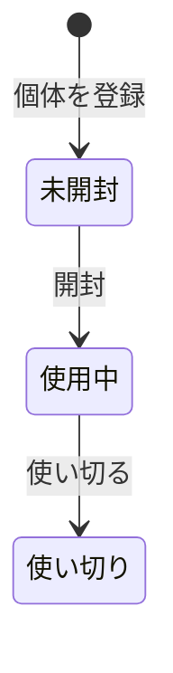

# 在庫・使用中仕様（iOS画面と業務ルール）

> [概要](./index.md) / [商品](./catalog-spec.md) / [データモデル](./data-model-spec.md)

## 管理単位と画面

在庫は1本を1個体として記録する。同じ商品を何本でも追加でき、期限と開封日を個体ごとに編集できる。

| 画面 | 表示と操作 |
|:--|:--|
| 在庫・使用中の一覧 | 未開封と使用中を区別し、商品名、種類、期限、期限状態を表示する。商品別の本数と個体別の詳細に進める。 |
| 個体登録 | 商品を選び、賞味期限を手入力または印字の読み取りで設定して1本を登録する。初期状態は未開封。 |
| 個体詳細・編集 | 期限、開封日、状態を表示・編集し、開封、使い切り、個体削除を行う。 |

1本の追加は毎回独立した ID を発行する。1回の登録操作で1本を作り、同じ商品を複数本追加する場合は操作を繰り返せる。期限未入力でも保存可能とし、一覧には「期限未設定」と表示する。

賞味期限の読み取りは[OCR仕様](./ocr-spec.md)に従う。選択した日付候補を編集可能な入力欄へ反映し、利用者が確認してから個体を保存する。認識結果だけで個体を自動作成しない。

## 状態遷移

| 操作 | 前提 | 結果 |
|:--|:--|:--|
| 開封 | 未開封 | 開封日は当日を初期値とし、確認前に過去の日付へ編集できる。状態は使用中になる。 |
| 使い切る | 使用中 | 使い切り日を記録し、通常一覧から外して[履歴](./history-spec.md)へ移す。 |
| 期限・開封日の編集 | 該当個体を開く | 商品や他の個体に影響させず、この1本だけを更新する。 |
| 個体削除 | 未開封または使用中 | 確認後にこの1本を削除する。履歴の削除は別仕様。 |

使い切り状態への直接登録、使い切りから使用中への戻し、未開封への戻しは初版では扱わない。開封日を未来の日付にはできず、使い切り日は開封日より前にできない。開封日のない未開封個体に使い切り日は設定しない。

## 期限の表示

端末のローカル日付を基準とし、時刻ではなく暦日で判定する。

| 判定 | 表示 |
|:--|:--|
| 期限が今日より前 | 「期限切れ」と期限日を強調 |
| 今日から7日後まで（両端を含む） | 「期限が近い」と期限日を強調 |
| 8日後以降 | 期限日を通常表示 |
| 期限がない | 「期限未設定」 |

色だけに頼らず文字でも状態を示す。未開封・使用中の両方に適用する。期限の強調はアプリ内の一覧と詳細に限り、端末通知は初版の対象外とする。

## 保存とエラー

状態変更と日付変更は同じ個体に対する一回の保存として扱う。保存に失敗した場合、画面上の入力と元の保存済み状態を区別し、再試行できる。オフラインでローカル保存できた変更は有効とし、同期保留を別に表示する。

## 既存コードとの関係

旧 UIKit / Core Data アプリの一覧は `type` ごとのセクションを作るが、セルは商品名しか設定しておらず、登録先も空画面である。さらに古い試作には商品を選んで賞味期限と開封日を入力する経路がある一方、使用中の一覧は仮データである。この文書は実装済みの宣言ではない。
